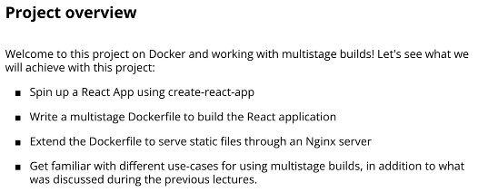
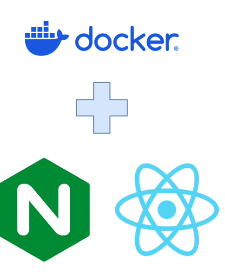

# Docker Project: Containerize React App




## Docker Installation

```sh
# Add Docker's official GPG key:
sudo apt update
sudo apt install ca-certificates curl
sudo install -m 0755 -d /etc/apt/keyrings
sudo curl -fsSL https://download.docker.com/linux/ubuntu/gpg -o /etc/apt/keyrings/docker.asc
sudo chmod a+r /etc/apt/keyrings/docker.asc

# Add the repository to Apt sources:
sudo tee /etc/apt/sources.list.d/docker.sources <<EOF
Types: deb
URIs: https://download.docker.com/linux/ubuntu
Suites: $(. /etc/os-release && echo "${UBUNTU_CODENAME:-$VERSION_CODENAME}")
Components: stable
Signed-By: /etc/apt/keyrings/docker.asc
EOF

sudo apt update

sudo apt install docker-ce docker-ce-cli containerd.io docker-buildx-plugin docker-compose-plugin
sudo systemctl status docker
```

## IMPORTANT! What to do if you face an error with create-react-app

```
😊 
This is an important note that addresses an issue several participants have pointed out with the last versions of create-react-app and its typescript template. 
Here is how the error looks like. 
If you are facing such an error, check below for the solution steps! 
I do expect this error to be temporary and fixed with newer versions of create-react-app and the typescript template, 
so you need to follow the steps below only if you are seeing the error.
```

```sh
npm error code ERESOLVE
npm error ERESOLVE unable to resolve dependency tree
npm error
npm error While resolving: containerize-react-app@0.1.0
npm error Found: react@19.0.0
npm error node_modules/react
npm error react@"^19.0.0" from the root project
npm error
npm error Could not resolve dependency:
npm error peer react@"^18.0.0" from @testing-library/react@13.4.0
npm error node_modules/@testing-library/react
npm error @testing-library/react@"^13.0.0" from the root project
npm error
npm error Fix the upstream dependency conflict, or retry
npm error this command with --force or --legacy-peer-deps
npm error to accept an incorrect (and potentially broken) dependency resolution.
npm error
npm error
npm error For a full report see:
npm error C:\Users\rober\AppData\Local\npm-cache\_logs\2025-01-30T16_20_05_898Z-eresolve-report.txt
npm error A complete log of this run can be found in: C:\Users\rober\AppData\Local\npm-cache\_logs\2025-01-30T16_20_05_898Z-debug-0.log
`npm install --no-audit --save @testing-library/jest-dom@^5.14.1 @testing-library/react@^13.0.0 @testing-library/user-event@^13.2.1 @types/jest@^27.0.1 @types/node@^16.7.13 @types/react@^18.0.0 @types/react-dom@^18.0.0 typescript@^4.4.2 web-vitals@^2.1.0` failed
```
## Fixing the error

```
Why this happens? 
This is a common error that can show up with create-react-app, 
and that's because there are many dependencies that are installed behind the scenes, 
and newer versions of NPM throw an error if there are some conflicting constraints. 
In the case of create-react-app, 
we cannot actively change the underlying dependencies (this is done through the react-scripts package), 
so we need to leverage the force or legacy-peer-deps option of npm. 
Nonetheless, 
I also expect such errors to not stay happening for long, since newer, 
more stable versions of create-react-app and its typescript template will be released with time.

Removing the typescript template might address the issue, 
but it's not a guaranteed solution, since the underlying set of dependencies of create-react-app might themselves contain some conflicts.
```
- Here are the steps you need to follow to fix the error:
    1. Set the force option for npm to true with: npm config set force true
    2. Run the create-react-app as usual: npx create-react-app --template typescript containerize-react-app
    3. Set the force option for npm to false: npm config set force false
    4. Test that the application is working as expected with cd containerize-react-app && npm start
    5. In the Dockerfile that is created in the following lectures, use npm ci --force instead of just npm ci. The code is already updated in the lab repo: https://github.com/lm-academy/docker-course/commit/e7c7eca402b6ff0a3bf7333a22f3e13cf85c57d5

## Create a React App 

```sh
npx create-react-app react-app


```